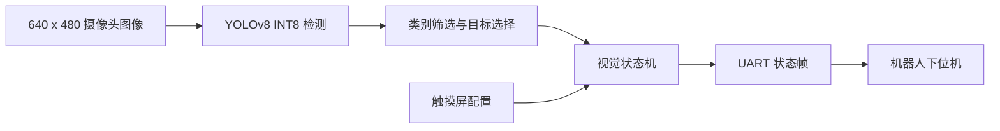
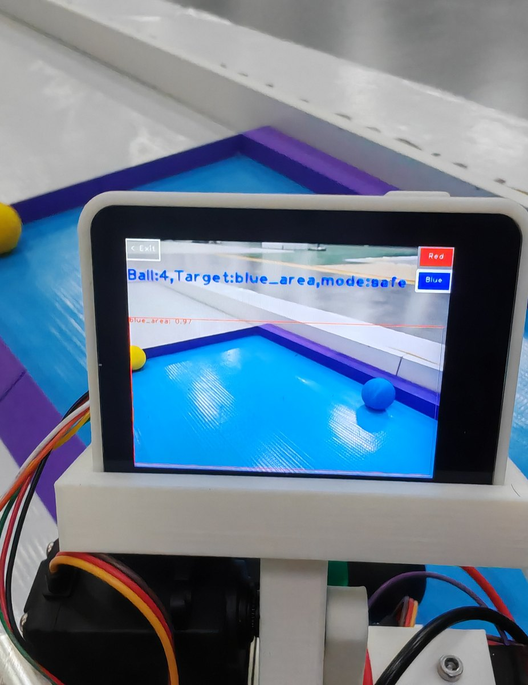

# 2025 Intelligent Rescue Vision

面向中国大学生工程实践与创新能力大赛智能救援赛项的端侧视觉与决策模块。程序运行在 MaixCAM Pro 上，使用 YOLOv8 INT8 模型识别救援目标和安全区，根据机器人当前状态选择目标，并通过 UART 向下位机发送目标位置与任务状态。本项目获省一等奖。

本仓库只公开视觉与决策模块，不包含底盘控制、机械结构、训练数据、训练脚本和完整机器人工程。

## 项目任务

比赛场景为双车对抗的智能救援任务。机器人需要在自主运行过程中识别场地中的救援目标，区分本方目标、核心目标、危险目标和本方安全区，并将目标转运到对应安全区。视觉模块需要同时处理以下工作：

1. 从摄像头图像中检测目标类别和检测框；
2. 根据本方颜色、已转运目标数量和运行策略选择当前目标；
3. 在抓取校验和安全区投放阶段切换视觉状态；
4. 将目标坐标、面积和状态码通过串口发送给机器人下位机。

## 运行平台

MaixCAM Pro 是 Sipeed 基于算能 SG2002 SoC 的端侧 AI 视觉设备。官方硬件资料列出该平台包含 1 TOPS@INT8 NPU、1 GHz RISC-V C906 Linux 处理器、256 MB DDR3，以及 640 x 480 电容触摸屏。本项目通过 MaixPy v4 调用摄像头、NPU 推理、显示、触摸屏和 UART 接口。

相关资料： [MaixCAM Pro 硬件文档](https://wiki.sipeed.com/maixcam-pro) · [MaixPy v4](https://wiki.sipeed.com/maixpy/) · [MaixVision](https://wiki.sipeed.com/en/maixvision)

## 我负责的部分

> 说明：训练数据和训练脚本未随仓库公开，下面的数据集规模及比赛阶段效果是已确认的历史项目记录，与当前公开仓库的设备复测结果分开列出。

- 整理并训练六类目标检测模型，类别为红/蓝普通目标、黑色核心目标、黄色危险目标、红/蓝安全区；
- 构建 350 张原始图像数据集，按 300/50 划分训练集和验证集，并使用 Albumentations 将训练数据扩增至 1500 张；
- 将 YOLOv8 模型转换为 INT8 部署格式，在 MaixCAM Pro（SG2002 SoC 内置 NPU）上完成端侧推理；
- 编写目标筛选和视觉状态机，根据队伍颜色、载球数量、目标优先级以及安全区状态切换目标搜索和安全区投放模式；
- 设计视觉模块与下位机之间的 UART 数据帧，输出目标中心坐标、目标面积、识别状态和抓取有效性状态码；
- 制作 MaixCAM 触摸界面，用于切换红/蓝方、N/P 策略和 OSD 调试信息。

## 系统流程



## 检测类别

| 标签 | 含义 | 用途 |
| --- | --- | --- |
| `red` | 红色普通目标 | 红方目标搜索 |
| `blue` | 蓝色普通目标 | 蓝方目标搜索 |
| `black` | 黑色核心目标 | 按策略参与目标排序 |
| `yellow` | 黄色危险目标 | 抓取条件校验 |
| `red_area` | 红色安全区 | 红方投放定位 |
| `blue_area` | 蓝色安全区 | 蓝方投放定位 |

## 关键实现

### 端侧推理

- 输入图像：`640 x 480`；
- 模型：YOLOv8，6 类，INT8 量化；
- 置信度阈值：`0.60`；
- IoU 阈值：`0.45`；
- 推理器默认开启 `dual_buff=True`，使用 MaixCAM 的硬件双缓冲模式；
- 模型配置和部署模型位于 [`models/`](models/) 目录，应用入口为 [`main.py`](main.py)。

`dual_buff=True` 使用 MaixPy 的双输入/输出缓冲推理模式：NPU 推理时准备下一帧输入，以提高流水线吞吐率；如果要求每次输出严格对应当前输入，应关闭该模式。因此本项目的 `39.85 FPS` 是流水线吞吐率，不等同于同步单帧延迟。

### 目标选择与状态机

程序维护队伍颜色、当前目标、已转运数量、N/P 策略和安全区模式等状态。正常运行时，先从当前检测结果中筛选目标，再按当前策略选择面积较大的候选框；收到抓取完成信号后，程序在指定区域内重新检测并判断抓取是否有效；进入安全区模式后，目标切换为本方安全区，收到到达信号后恢复目标搜索。

### UART 通信

程序发送固定长度的 11 字节数据帧：

```text
AA BB X_H X_L Y_H Y_L TYPE AREA_H AREA_L STATUS CC
```

- `X_H/X_L`、`Y_H/Y_L`：目标中心坐标，按百位和余数拆分；
- `TYPE`：`0x11` 表示找到目标，`0x22` 表示未找到目标，`0x00` 用于状态通知帧；
- `AREA_H/AREA_L`：缩放后的检测框面积；
- `STATUS`：`0x33` 表示抓取有效，`0x44` 表示抓取无效，`0x55` 表示继续搜索；
- `0xDD`：接收抓取完成信号并执行抓取条件判断；
- `0xCC`：接收安全区到达信号并恢复目标搜索。

默认串口为 `/dev/ttyS0`，波特率为 `115200`。

## MaixVision 中运行

1. 打开 MaixVision，并连接 MaixCAM Pro。
2. 在 IDE 中打开本仓库文件夹，确认 `main.py`、`models/` 和 `app.yaml` 位于项目根目录。
3. 选择直接运行即可在设备上启动程序；程序启动后默认关闭 OSD 调试绘制，触摸屏仍保留队伍颜色、策略、OSD 和退出按钮。
4. 需要脱机安装时，使用 MaixVision 内置的应用打包/发布功能生成安装包，再安装到设备。

`app.yaml` 中列出了入口文件、图标和模型文件，打包时会将这些文件一起加入应用。默认串口为 `/dev/ttyS0`，波特率为 `115200`。

## 当前实测结果

以下结果均在 MaixCAM Pro 脱机运行环境下测得，主指标统一使用 `dual_buff=True`：

| 测试对象 | 测量范围 | 结果 |
| --- | --- | --- |
| 视觉推理流水线 | 连续 300 次 `detect()`，不计显示、UART 和目标决策 | 平均 `25.094 ms`，等效 `39.85 FPS` |
| 视觉推理流水线稳定性 | 同一轮测量 | 中位数 `25.366 ms`，P95 `25.771 ms`，范围 `23.393–29.208 ms` |
| 完整比赛运行链路 | 预热 30 秒后统计 180 秒，18 个 10 秒窗口 | 平均 `29.98 FPS`，窗口范围 `29.95–30.02 FPS` |

同步单帧对照（`dual_buff=False`）平均耗时为 `41.704 ms`，仅用于理解双缓冲流水线与同步调用的差异，不作为默认部署指标。不同固件、摄像头环境和显示设置可能导致结果变化。

比赛阶段的已确认记录为：模型训练阶段准确率 `99%`，INT8 部署现场测试识别准确率 `94%`，运行帧率约 `25 FPS`。这些数据对应比赛阶段的测试口径，不替代上表中的当前复测结果。

## 运行截图



## 仓库结构

```text
2025-intelligent-rescue-vision/
├── main.py                    # MaixCAM 视觉与决策程序
├── app.yaml                   # Maix 应用配置与打包文件清单
├── models/
│   ├── help_int8.mud          # 模型配置
│   └── help_int8.cvimodel     # NPU 部署模型文件
├── assets/
│   ├── app.png                # 应用图标
│   └── device-demo.jpg        # 实机运行照片
├── LICENSE
└── README.md
```

## 当前限制

- 仓库只覆盖摄像头、端侧检测、目标决策和 UART 输出，不包含底盘运动控制、机械抓取和无线通信；
- 训练数据、标注文件和训练脚本未公开，模型文件仅用于 MaixCAM 部署；
- 当前记录的是部署版本的推理吞吐率和完整运行 FPS，现场识别准确率没有根据历史视频重新推断；
- 视频演示暂未放入首版仓库，后续如有剪辑后的短视频再单独添加。

## License

本项目使用 [MIT License](LICENSE)。
