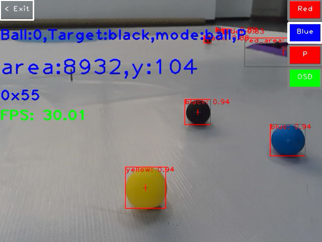
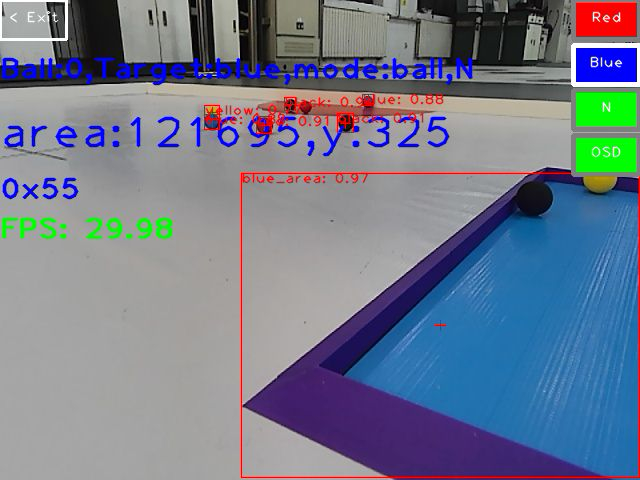
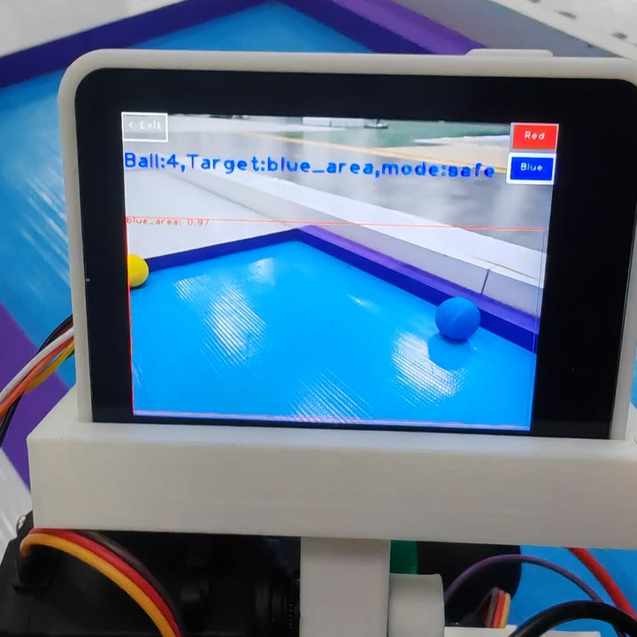
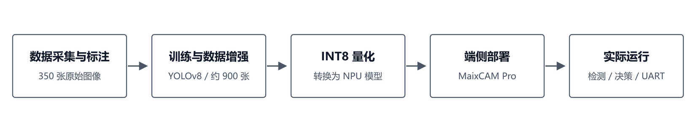
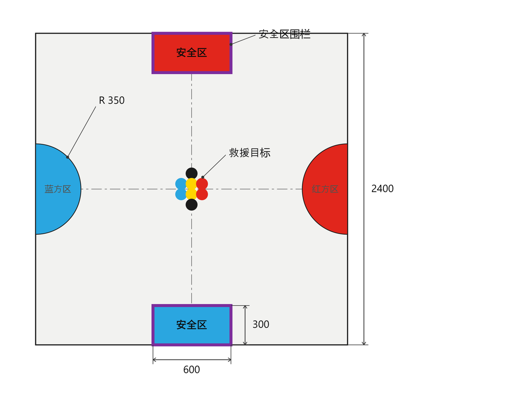

# 2025年中国大学生工程实践与创新能力大赛“智能+”赛道智能救援赛项--视觉部分

本项目用于 2025 年智能救援比赛。机器人需要识别场地中的红、蓝、黄、黑四类物料以及红、蓝安全区，并根据队伍颜色和任务状态完成目标选择、抓取校验和安全区定位。项目最终获省一等奖。

我负责视觉部分：

- 采集并标注 350 张图像，按 300/50 划分训练集和验证集，使用 Albumentations 将 300 张训练图像增强至 900 张。
- 训练 YOLOv8 目标检测模型，完成模型 INT8 量化与格式转换，并部署至 MaixCAM Pro，调用板载 NPU 实现端侧推理。
- 编写目标筛选、策略切换、视觉状态机和 UART 通信程序。

最终，训练阶段准确率为 `99%`，量化模型在数据集上的识别准确率为 `96%`，实际运行链路平均达到 `29.98 FPS`；决赛更换不同形状的物料后模型仍能完成稳定识别。

## 实际效果

  
  

  

https://github.com/user-attachments/assets/0d71a792-9df0-45c7-b79a-56d0c6fcfa3d

## 项目流程

  

## 实测结果

<table align="center">
  <thead>
    <tr>
      <th align="left">指标</th>
      <th align="center">结果</th>
    </tr>
  </thead>
  <tbody>
    <tr>
      <td>训练阶段准确率</td>
      <td align="center"><code>99%</code></td>
    </tr>
    <tr>
      <td>INT8 量化模型在数据集上的识别准确率</td>
      <td align="center"><code>96%</code></td>
    </tr>
    <tr>
      <td>纯视觉推理流水线平均 FPS</td>
      <td align="center"><code>39.85</code></td>
    </tr>
    <tr>
      <td>实际运行链路平均 FPS</td>
      <td align="center"><code>29.98</code></td>
    </tr>
  </tbody>
</table>

## 比赛场地

  

## 仓库说明

本仓库保留 MaixCAM Pro 设备端程序、YOLOv8 INT8 量化模型、Maix 应用配置及运行素材。在 MaixVision 中打开仓库文件夹即可运行，也可以直接使用 IDE 的打包功能生成安装包。

- 数据集由项目团队人工采集并标注，暂不方便公开；如需了解数据集构成或标注方式，请联系我。
- 仓库只包含摄像头、目标检测、视觉决策和 UART 输出，不包含底盘控制和机械抓取等下位机部分。
- 项目使用 [MIT License](LICENSE)。
