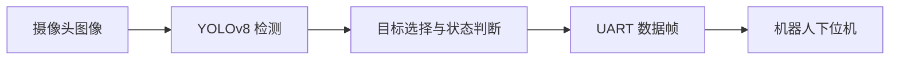

# 2025 Intelligent Rescue Vision

这是 2025 年中国大学生工程实践与创新能力大赛智能救援赛项中使用的视觉与决策模块，项目获省一等奖。

程序运行在 MaixCAM Pro 上，使用 YOLOv8 INT8 模型识别红、黄、黑、蓝四类救援目标以及红、蓝安全区，并通过 UART 向机器人下位机发送目标位置和任务状态。

## 我负责的部分

- 整理并训练六类目标检测模型，在 MaixCAM Pro 上完成 INT8 模型部署；
- 根据队伍颜色、载球数量和安全区状态选择当前目标；
- 通过 UART 发送目标中心坐标、目标面积和抓取校验结果；
- 制作触摸界面，用于切换红/蓝方、运行策略和调试信息显示。

## 使用技术

- MaixCAM Pro / MaixPy
- YOLOv8 / INT8 量化模型
- Python
- UART 串口通信

## 运行流程



## 运行截图


## 安装与运行

项目需要在 MaixCAM Pro 上运行。电脑端先安装 `maixtool`：

```bash
pip install maixtool
```

在项目根目录执行以下命令，可生成应用安装包：

```bash
maixtool release
```

也可以让电脑和 MaixCAM 连接同一局域网，然后执行：

```bash
maixtool deploy
```

设备端使用应用商店扫描命令生成的二维码即可安装。串口默认使用 `/dev/ttyS0`，波特率为 `115200`。

## UART 输出

程序发送固定 11 字节数据帧：

```text
AA BB X_H X_L Y_H Y_L TYPE AREA_H AREA_L STATUS CC
```

- `X_H/X_L`、`Y_H/Y_L`：目标中心坐标，按百位和余数拆分；
- `TYPE`：`0x11` 表示找到目标，`0x22` 表示未找到目标，状态通知帧中为 `0x00`；
- `AREA_H/AREA_L`：缩放后的检测框面积；
- `STATUS`：`0x33` 抓取有效，`0x44` 抓取无效，`0x55` 未抓到球或继续搜索。

程序接收 `0xDD` 后检查抓取结果，接收 `0xCC` 后退出安全区模式并继续寻找目标。

## 当前状态

- 仓库只包含视觉与决策模块，不包含底盘控制、机械结构、训练数据和训练脚本；
- 当前模型和代码来自比赛时的最终版本；
- 在 MaixCAM Pro 脱机运行测试中，双缓冲视觉推理流水线平均约 39.85 FPS；包含取图、决策、UART 和显示的完整循环平均约 29.98 FPS，18 个窗口范围为 29.95–30.02 FPS；
- 同步单帧对照测试（关闭双缓冲）平均 41.704 ms，仅用于理解流水线优化，不作为默认部署指标；
- 现场识别准确率和连续运行结果不在本次测试中重新推断，测试口径记录在 [测试记录](docs/test-record.md)。

## License

本项目使用 [MIT License](LICENSE)。
