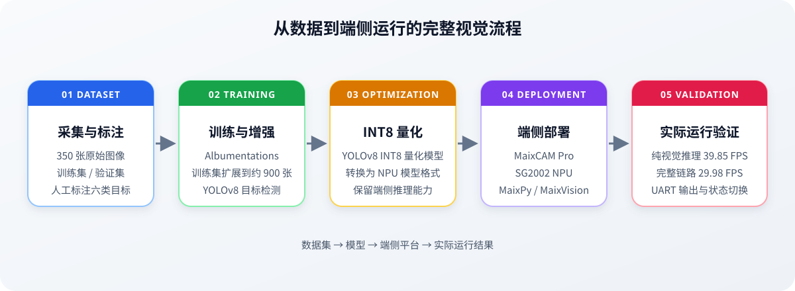
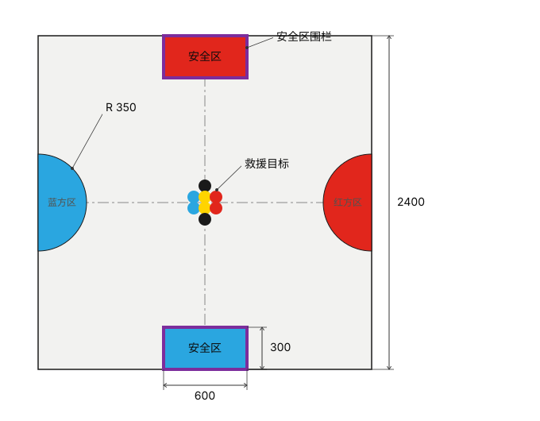

# 2025 Intelligent Rescue Vision

面向智能救援比赛的端侧视觉与决策模块。项目完成了从数据集采集与标注、模型训练、YOLOv8 INT8 量化，到 MaixCAM Pro 端侧部署和实际运行验证的完整流程，项目获省一等奖。

本仓库公开视觉与决策部分，包括 MaixCAM Pro 应用源码、YOLOv8 INT8 量化模型和部署配置；不包含底盘控制、机械结构和完整训练数据。

## 项目流程

<p align="center">
  
</p>

## 我负责的工作

- 采集并人工标注 350 张图像，按 300/50 划分训练集和验证集；使用 Albumentations 对 300 张训练集图像进行数据增强，扩展到约 900 张。
- 训练六类目标检测模型：红/蓝普通目标、黑色核心目标、黄色危险目标、红/蓝安全区。
- 将 YOLOv8 模型转换为 YOLOv8 INT8 量化模型，并部署到 MaixCAM Pro 的 NPU 上运行。
- 编写目标筛选、策略切换和视觉状态机，根据队伍颜色、目标数量和安全区状态选择目标。
- 通过 UART 向机器人下位机发送目标坐标、面积、目标类型和抓取状态；发送帧使用 `AA BB` 帧头和 `CC` 帧尾。

## 运行平台与部署

MaixCAM Pro 基于算能 SG2002 SoC，包含 INT8 NPU、RISC-V C906 处理器和 Linux 系统。本项目使用 MaixPy v4 调用摄像头、NPU、显示和 UART。

在 MaixVision 中打开仓库文件夹即可运行；`app.yaml` 已列出入口文件、图标和模型文件，也可以使用 MaixVision 的打包功能生成安装包。

## 比赛场地

<p align="center">
  
</p>

## 主要结果

| 指标 | 结果 |
| --- | ---: |
| 训练阶段准确率 | `99%` |
| YOLOv8 INT8 量化模型在数据集上的识别准确率 | `96%` |
| 纯视觉推理流水线平均 FPS | `39.85` |
| 完整比赛运行链路平均 FPS | `29.98` |

完整运行链路的测试记录为 18 个 10 秒窗口，平均 `29.98 FPS`。

决赛规则会随机更换物料。更换物料后，模型仍能识别不同形状的目标，表现出较好的泛化能力。

## 运行截图

<p align="center">
  
</p>

## 仓库结构

```text
2025-intelligent-rescue-vision/
├── main.py                    # MaixCAM 视觉与决策程序
├── app.yaml                   # Maix 应用配置与打包文件清单
├── models/
│   ├── help_int8.mud          # 模型配置
│   └── help_int8.cvimodel     # YOLOv8 INT8 量化部署模型
├── assets/
│   ├── app.png                # 应用图标
│   ├── project-pipeline.svg   # 项目流程图
│   ├── device-demo.jpg        # 实机运行照片
│   └── rescue_competition_field_layout.svg  # 比赛场地示意图
├── LICENSE
└── README.md
```

## 说明

- 数据集由项目团队人工采集并标注，暂不方便公开；如需了解数据集构成或标注方式，请联系我。
- 本仓库只覆盖摄像头、端侧检测、目标决策和 UART 输出，不包含底盘运动控制、机械抓取和无线通信。
- 视频演示暂未放入仓库，后续准备好剪辑版本后再添加。

## License

本项目使用 [MIT License](LICENSE)。
